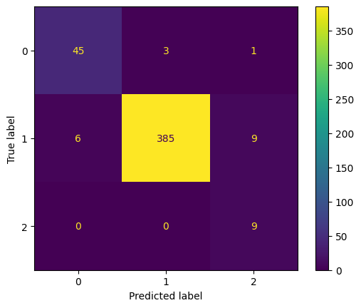
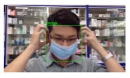
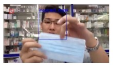

# Detecting Face Mask Usage in Images and a Video
## Project Overview
This project focuses on selecting a reliable model for detecting face masks in images and a video. Four models were built and evaluated: two SVM (Support Vector Machine) models using different approaches - SIFT (Scale-Invariant Feature Transform) with K-Means and SVM, and HOG (Histogram of Oriented Gradients) with SVM - an MLP (Multilayer Perceptron), and a pre-trained ResNet34 CNN (Convolutional Neural Network). Each model employs a different feature extraction approach, enabling a comparison of their effectiveness in image classification tasks. The best performing model was tested on a video to evaluate its performance in a more realistic scenario.

## Project Files
- **Data**: Images are stored in the `data/image` and a video is in the `data/video` folder.
- **Notebooks**: The notebook for training and testing is located in the `notebooks/` folder.
- **Results**: The trained models are saved in the `results/models` folder. Visualisations, such as confusion matrix, can be found in the `results/figures` folder, which also includes screenshots of the face mask detection in the video.

## Methodology 
- **Data Preprocessing**: Images were resized to 256x256 using interpolation. SVM and MLP datasets were split 80:20 for training and validation. ResNet34 images underwent additional augmentation (flipping, colour changes, etc) to improve model generalisation, given class imbalances. Images were normalised by their calculated mean and standard deviation. For video testing, OpenCV's VideoCapture function detected faces, starting with a minimum size of 300x300, resizing faces to 224x224 for ResNet. The model applied bounding boxes and visual predictions on each detected face within the video frames.
- **Modeling**: Four models were created for this task.
  
  ***SVM with SIFT***: Used SIFT to extract key features from the images, which were then clustered via K-means (10x the number of labels) for training a Support Vector Machine (SVM).
  
  ***SVM with HOG***: Utilised HOG to generate feature histograms from gradients, used to train another SVM.
  
  ***MLP with HOG***: HOG features were also used to train an MLP model, acting as a baseline neural network.
  
  ***ResNet34***: Employed a pre-trained ResNet34 model from PyTorch for convolutional feature extraction without additional feature engineering, as the layers in the model inherently capture essential patterns.
- **Training and Hyperparameter Optimisation**:
  
  ***SVM and MLP***: Grid search was applied to identify optimal hyperparameters. SVM tuning focused on regularisation C, gamma, and kernel type, while MLP underwent a two-stage search: the first round optimised hidden layers, activation, and optimiser; the second tuned regularisation alpha, learning rate, and momentum.
  
  ***ResNet34***: Fine-tuned with a lower learning rate (0.0001) and increased epochs (100) to increase accuracy in face mask detection. Used the Adam optimiser to refine performance with smaller incremental updates.

- **Evaluation**: Assess models using accuracy and confusion matrices on the test set. The best performing model is ResNet34.

  ***Model comparison using the image test set***
  
  | Model Name | Training Speed (sec) | Test Accuracy | Model Size |
  | --- | --- | --- | --- |
  | SIFT+SVM | 0.42 (CPU) | 0.60 | 374 KB |
  | HOG+SVM | 5.87 (CPU) | 0.82 | 23.1 MB |
  | HOG+MLP | 4.91 (CPU) | 0.85 | 1.6 MB |
  | ResNet34 | 4080.90 (Google Colab GPU used) | 0.95 | 81.3 MB |

  ***ResNet34 Image Test Result***
  
  
  Lable: 0 = no mask, 1 = mask, 2=wrong mask

    ***ResNet34 Video Test Result***
  
      

## Key Findings
- **Model Performance**: The high accuracy and reliable predictions of ResNet34 on both images and video suggest its effectiveness for image classification tasks, despite occasional misclassifications.

- **Future Work**: To improve ResNet34's robustness, especially with imbalanced classes, explicitly adding augmented images to the training set could be considered. This would involve generating and saving augmented images before training, creating a larger, more balanced dataset.

## Used Datasets
- **Face Mask Video**: [How To Wear Face Mask The Right Way](https://youtu.be/W_9jLju5FuQ?feature=shared)
- **Face Mask Images**: Images are randomly mixed from multiple public datasets.
